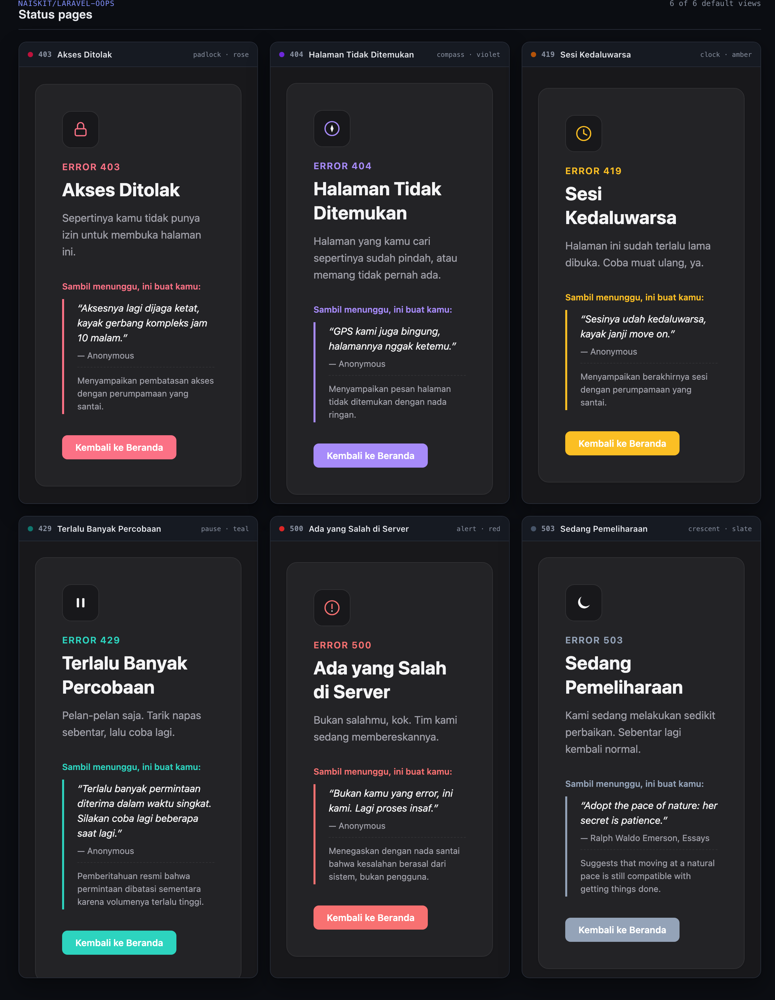
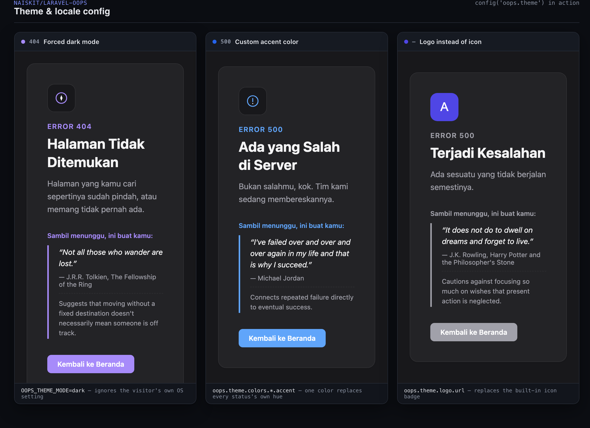

# laravel-oops

[](https://packagist.org/packages/naiskit/laravel-oops)
[](https://github.com/naiskit/laravel-oops/actions/workflows/tests.yml)
[](https://codecov.io/gh/naiskit/laravel-oops)
[](https://packagist.org/packages/naiskit/laravel-oops)
[](LICENSE.md)

A friendly Laravel error page package that makes unexpected errors a little
less frustrating — with a random quote (matched to the kind of error) to
keep users company while things get fixed.

## Preview





Every card above is a real render of the package's own views. See
[Theme](#theme) for colors, dark mode, and logo, and
[Previewing the page](#previewing-the-page) to render any status locally.

## Requirements

- PHP ^8.2
- Laravel ^11.0, ^12.0, or ^13.0

## Installation

```bash
composer require naiskit/laravel-oops
```

The service provider is auto-discovered — no wiring needed. As soon as it's
installed, unhandled 403 / 404 / 419 / 429 / 500 / 503 responses (when
`APP_DEBUG=false` and the request expects HTML) get the friendly page
automatically.

### (Optional) Publish

```bash
# config/oops.php — enable/disable, status list, per-status copy
php artisan vendor:publish --tag=oops-config

# resources/quotes/oops/ — your own quote folders (one folder per status)
php artisan vendor:publish --tag=oops-quotes

# resources/views/vendor/oops/ — one Blade view per status code
php artisan vendor:publish --tag=oops-views
```

## How it works

The package registers a `renderable()` callback on Laravel's exception
handler. It only steps in when:

- the exception's status code is in `oops.statuses` (default: `403, 404,
  419, 429, 500, 503`; anything not an `HttpException` — e.g. a random
  uncaught error — is treated as `500`),
- the request does **not** expect JSON,
- `APP_DEBUG` is off (or `oops.force` is `true`),
- and nothing else (your own app code, another package) has already
  handled the exception.

Auth redirects (`AuthenticationException`), validation errors
(`ValidationException`), and `HttpResponseException` are always left alone.

## A view per error, not one shared template

Each status code has its own Blade view — [`404.blade.php`](resources/views/404.blade.php),
[`403.blade.php`](resources/views/403.blade.php), and so on — with its own
icon, resolved automatically as `oops::{status}` and falling back to
[`general.blade.php`](resources/views/general.blade.php) for any status
without a dedicated file:

| Status | Motif | Default accent |
|---|---|---|
| 404 | compass | violet |
| 403 | padlock | rose |
| 419 | clock | amber |
| 429 | pause | teal |
| 500 | alert | red |
| 503 | crescent moon | slate |
| *(fallback)* | dot | zinc |

They all `@include('oops::layout', ['icon' => '<svg markup>'])` — a shared
partial that owns the page chrome (head, CSS, card structure) *and* theme
resolution, the same pattern Laravel itself uses for its own
`resources/views/errors/*.blade.php`. A status view only ever declares its
icon; everything visual beyond that — colors, dark mode, an optional logo —
comes from `config('oops.theme')` via
`Naiskit\LaravelOops\Rendering\ErrorPageComposer` (see
[Theme](#theme) below), so a style tweak doesn't need repeating across
seven files, and each status stays free to differ only in icon or,
eventually, its own layout entirely.

Publishing (`--tag=oops-views`) copies the whole folder — including
`layout.blade.php` — so you can edit any single status view, or add a
`{code}.blade.php` for a status not covered by default, without touching
the rest. To force one view for every status instead, set `oops.view` in
config to a view name — note that also switches which status's default
accent applies (see [Theme](#theme)).

## Quotes matched to the error

Quotes live under [`resources/quotes/`](resources/quotes/), **one folder
per status code** (`404/`, `403/`, `419/`, `429/`, `500/`, `503/`,
`general/`), so the tone fits the situation — lost-and-wandering quotes for
404, forbidden-door quotes for 403, patience/slow-down quotes for 429, and
so on. Anything without its own group falls back to `general/`.

```
resources/quotes/
├── index.php        ← loads every *.php file in each folder below, no editing needed
├── 404/
│   └── default.php
├── 403/
│   └── default.php
├── ...
└── general/
    └── default.php
```

```php
// resources/quotes/404/default.php
return [
    [
        'text' => 'Not all those who wander are lost.',
        'author' => 'J.R.R. Tolkien',
        'source' => 'The Fellowship of the Ring',
        'lang' => 'en',
        'genre' => 'wise',
        'meaning' => 'Suggests that moving without a fixed destination doesn\'t necessarily mean someone is off track.',
    ],
    // ...
];
```

`meaning` is an optional short, neutral note on what the quote is getting
at — shown under the quote on the error page (below a thin divider) when
present. Leave it out (or `null`) to skip that line for a given quote.

The quote is introduced by a short lead line (e.g. *"While you wait, here's
something for you:"*) so it reads as the page addressing you, not a random
citation dropped in — configurable per locale via `oops.ui.{locale}.quote_lead`
(see [Locale](#locale) below).

Publishing (`--tag=oops-quotes`) copies the whole tree to
`resources/quotes/oops/` in your app — the exact path `config('oops.quotes_path')`
already points at by default, so no further config is needed. To add more
quotes, **just drop a new file into the matching folder** — e.g.
`resources/quotes/oops/403/source1.php` returning its own array of quote
entries — `index.php` picks it up automatically, no editing required.

Each quote also carries `lang` (`id`/`en`) and `genre` (`wise`, `humor`,
`formal`, or any label you invent). Control which ones get picked via
`config/oops.php`:

```php
'quote_languages' => ['id', 'en'], // [] = all languages
'quote_genres' => ['humor'],       // [] = all genres
```

or via `.env`:

```
OOPS_QUOTE_LANGUAGES=id,en
OOPS_QUOTE_GENRES=humor,wise
```

If a status code's quote pool has nothing matching the configured
language/genre, the filter relaxes step by step (drop genre, then drop
language) so the page never renders without a quote.

This is a deliberately simple starting point — plain files are easy to grow
by hand for now. Publish with `--tag=oops-quotes` to maintain your own list
without touching the package. A future version can swap in a richer source
(a bigger curated set, an API, etc.) by implementing
`Naiskit\LaravelOops\Quotes\QuoteRepository` and rebinding it in the
container — the rest of the package (the exception hook, the view) doesn't
need to change.

Preview a quote for a given status, language, and genre from the CLI:

```bash
php artisan oops:quote 404
php artisan oops:quote 500 --lang=id --genre=humor
```

## Previewing the page

```bash
php artisan oops:preview        # defaults to 404
php artisan oops:preview 500
```

This renders the exact same view + data the exception handler would use for
that status — via the shared `Naiskit\LaravelOops\Rendering\ErrorPageComposer`
— and saves it to `storage/app/oops-preview-{status}.html`. Open that file in
a browser. Unlike triggering a real error, this works regardless of
`APP_DEBUG` or `oops.force`, so there's no need to toggle either just to look
at the page.

## Locale

The title, message, and "Back to Home" button follow `config('oops.locale')`
— separate from the quote language pool above, since a quote is picked from
a wider mix on purpose, while the page's own copy should read as one
language. `oops.locale` defaults to `null`, which means: follow the app's
own `config('app.locale')`, falling back to Indonesian if that locale isn't
one of the ones translated in `config('oops.messages')` (currently `id` and
`en`).

```php
'locale' => env('OOPS_LOCALE'), // null = follow app.locale, falls back to "id"
```

Force one language regardless of the app's locale via `.env`:

```
OOPS_LOCALE=en
```

`ui` holds the small labels that aren't per-status: `back_home` (the
button), `unknown_author` (fallback when a quote has no `author`), and
`quote_lead` (the line introducing the quote — see
[Quotes matched to the error](#quotes-matched-to-the-error) above).

Add another language by adding a new key under `messages`, `default_message`,
and `ui` in `config/oops.php` (e.g. `'fr' => [...]`), then set `OOPS_LOCALE=fr`
or switch the app's own locale to `fr`.

## Theme

By default the page follows the visitor's own OS/browser light-or-dark
setting (`prefers-color-scheme`), each status using its own accent color
(see the table in [A view per error](#a-view-per-error-not-one-shared-template)
above). All of that is configurable via `config('oops.theme')`.

**Force light or dark mode**, ignoring the visitor's own preference:

```php
'theme' => [
    'mode' => 'dark', // "system" (default), "light", or "dark"
],
```

```
OOPS_THEME_MODE=dark
```

**Override any color token**, per light/dark scheme. Leave a value `null`
to keep the built-in default for that token — `accent` is the one most
worth knowing about: setting it overrides *every* status's own accent with
one color of your choosing, instead of each status keeping compass/padlock/etc.
in its own hue:

```php
'theme' => [
    'colors' => [
        'light' => ['bg' => null, 'card' => null, 'text' => null, 'muted' => null, 'border' => null, 'accent' => '#2563eb'],
        'dark' => ['bg' => null, 'card' => null, 'text' => null, 'muted' => null, 'border' => null, 'accent' => '#60a5fa'],
    ],
],
```

Each token also has an `.env` variable (`OOPS_COLOR_LIGHT_BG`,
`OOPS_COLOR_LIGHT_ACCENT`, `OOPS_COLOR_DARK_BG`, etc.) — see
[`config/oops.php`](config/oops.php) for the full list.

**Show a logo instead of the built-in icon** — accepts anything a browser
can load: `asset()`, `Storage::url()`, or a full URL:

```php
'theme' => [
    'logo' => [
        'url' => asset('images/logo.png'),
        'width' => 56,
        'height' => 56,
    ],
],
```

```
OOPS_LOGO_URL=https://example.com/logo.png
OOPS_LOGO_WIDTH=56
OOPS_LOGO_HEIGHT=56
```

## Configuration

See [`config/oops.php`](config/oops.php) for all options: turning the
package off, forcing it on even with `APP_DEBUG=true`, which status codes
to intercept, the title/message per status code and locale, the quote
language/genre filters, and the theme (light/dark mode, colors, logo).

## Disabling in tests

Set `OOPS_ENABLED=false` in `phpunit.xml` (or your test `.env`) so
assertions against real error responses (e.g. `$response->assertStatus(404)`)
aren't affected by the friendly view.

## Testing

This is the package's own test suite (Orchestra Testbench + PHPUnit), for
anyone working on `laravel-oops` itself rather than just using it. CI runs
it across PHP 8.2–8.4 and Laravel 11/12/13:

```bash
composer install
composer test        # PHPUnit
composer format       # Laravel Pint (code style)
composer analyse      # PHPStan / Larastan
```

`tests/Feature/SecurityTest.php` specifically guards against exception
details (messages, stack traces, file paths) ever reaching the rendered
page — see [CONTRIBUTING.md](CONTRIBUTING.md) if you're touching anything
near exception rendering.

## Contributing

See [CONTRIBUTING.md](CONTRIBUTING.md).

## Security Vulnerabilities

Please don't open a public issue for security vulnerabilities — see
[SECURITY.md](SECURITY.md) for how to report one.

## Credits

- [Naiskit](https://github.com/naiskit)
- [All Contributors](https://github.com/naiskit/laravel-oops/contributors)

## License

The MIT License (MIT). See [LICENSE.md](LICENSE.md) for details.
